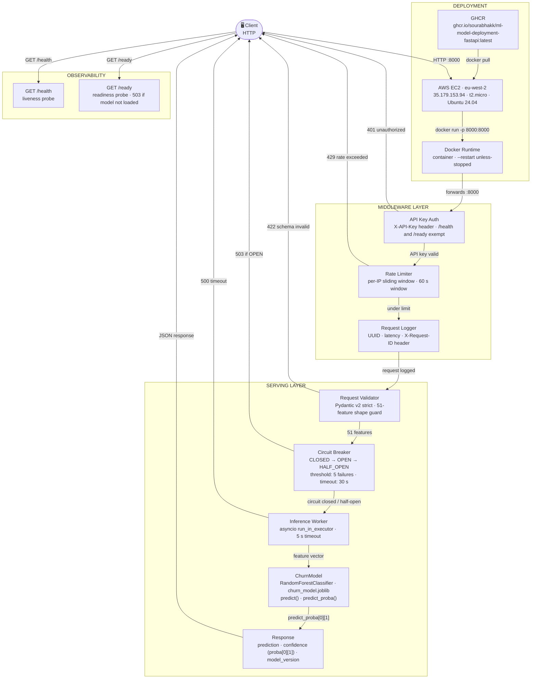

# ML Model Deployment — FastAPI Inference Service


Production-hardened FastAPI inference service serving a trained churn prediction model — containerised with Docker, deployed on AWS EC2, automated CI/CD via GitHub Actions.

---

## Architecture Diagram



---

## Request Flow Diagram

```mermaid
sequenceDiagram
    participant Client
    participant EC2
    participant AuthMiddleware
    participant RateLimiter
    participant RequestValidator
    participant CircuitBreaker
    participant InferenceWorker
    participant ChurnModel

    Client->>EC2: HTTP POST 35.179.153.94:8000/predict<br/>X-API-Key: &lt;key&gt;
    EC2->>AuthMiddleware: Docker runtime forwards to container :8000

    AuthMiddleware-->>Client: 401 Unauthorized (if key invalid or missing)
    AuthMiddleware->>RateLimiter: key valid → forward request

    RateLimiter-->>Client: 429 Too Many Requests (if per-IP window exceeded)
    RateLimiter->>RequestValidator: under limit → forward request

    RequestValidator-->>Client: 422 Unprocessable Entity (wrong type / not 51 features / empty)
    RequestValidator->>CircuitBreaker: 51-feature vector validated

    CircuitBreaker-->>Client: 503 Service Unavailable (if state = OPEN)
    CircuitBreaker->>InferenceWorker: circuit CLOSED or HALF_OPEN

    InferenceWorker->>ChurnModel: run_in_executor(model.predict, features)<br/>timeout: 5.0 s
    InferenceWorker-->>Client: 500 Prediction Timeout (asyncio.TimeoutError)

    ChurnModel->>ChurnModel: X = np.array([features])  shape (1, 51)
    ChurnModel-->>InferenceWorker: predict() → float · predict_proba() → proba[0][1]

    Note over InferenceWorker: float() cast · math.isfinite() guard
    InferenceWorker-->>Client: 500 (NaN/Inf or model error)

    InferenceWorker->>Client: 200 OK<br/>{"prediction": 0.0, "confidence": 0.183, "model_version": "1.0.0"}<br/>X-Request-ID: &lt;uuid&gt;
```

---

## Features

- **3-endpoint REST API** — `POST /predict`, `GET /health`, `GET /ready`
- **Real churn prediction** — RandomForestClassifier (100 estimators) trained on 7,043 Telco customer records; ROC-AUC 0.839; exported as `churn_model.joblib` from the training pipeline
- **Confidence scores via `predict_proba`** — churn probability (class 1) returned as `confidence`; extracted from `proba[0][1]` not `.max()`
- **3-layer input validation** — Pydantic v2 strict type coercion → 51-feature shape guard (`field_validator`) → global `@app.exception_handler` for DI-level failures
- **API key authentication middleware** — `X-API-Key` header enforced when `API_KEY` env var is set; `/health` and `/ready` always exempt
- **Per-IP sliding-window rate limiting** — 60-second window, configurable via `RATE_LIMIT_PER_MINUTE` (default: 0 = disabled)
- **Circuit breaker** — three-state machine (CLOSED → OPEN after 5 consecutive failures → HALF_OPEN after 30 s); opt-in via `CIRCUIT_BREAKER_ENABLED`
- **Async inference via `run_in_executor`** — blocking sklearn call offloaded to thread pool; 5-second `asyncio.wait_for` timeout guard
- **Centralised config via `pydantic-settings`** — all env vars typed and validated at startup; single `settings` instance across the app
- **Structured JSON logging with UUID request ID tracing** — every request assigned a UUID; latency logged; `X-Request-ID` echoed in response headers
- **Model artifact baked into Docker image** — `churn_model.joblib` copied into image at build time; no runtime download needed
- **Deployed on AWS EC2 (eu-west-2)** — containerised via Docker, image on GHCR, running with `--restart unless-stopped`
- **Live public endpoint** — `http://35.179.153.94:8000`
- **GitHub Actions CI/CD** — 28 pytest cases green on every push; Docker build verified with synthetic model artifact

---

## Project Structure

```
ml-model-deployment-fastapi/
├── src/
│   ├── app/
│   │   ├── main.py           # FastAPI app factory, lifespan hook, middleware stack
│   │   ├── config.py         # pydantic-settings: all env vars with types and defaults
│   │   ├── dependencies.py   # ChurnModel, joblib loader, thread-safe singleton
│   │   ├── routes.py         # /predict, /health, /ready endpoints + circuit breaker
│   │   └── schemas.py        # PredictionRequest/Response — strict Pydantic v2 models
│   └── core/
│       └── exceptions.py     # ModelNotLoadedError, PredictionError, InvalidInputError
├── models/
│   └── churn_model.joblib    # RF artifact baked into Docker image (gitignored, ~5 MB)
├── scripts/
│   └── generate_ci_model.py  # Generates synthetic artifact for CI Docker build
├── tests/
│   ├── test_health.py              # /health contract (3 tests)
│   ├── test_predict_contract.py    # /predict contract incl. confidence field (6 tests)
│   ├── test_validation.py          # Input rejection cases — shape, type, empty (5 tests)
│   ├── test_model_dependency.py    # DI injection, singleton, startup loading (4 tests)
│   ├── test_error_handling.py      # Model exceptions → HTTP 500 (4 tests)
│   └── test_integration.py         # End-to-end flows, headers, multi-request (6 tests)
├── Dockerfile                # python:3.11-slim, model artifact baked in, non-root user
├── docker-compose.yml        # Service definition with healthcheck on /ready
├── .env.example              # All env vars documented with defaults
├── .github/
│   └── workflows/
│       └── ci.yml            # test job → build job (synthetic model + Docker verify)
└── requirements.txt          # fastapi 0.109 · uvicorn 0.27 · pydantic 2.5.3 · sklearn
```

---

## Environment Variables

All variables managed by `src/app/config.py` via `pydantic-settings`. Copy `.env.example` to `.env` to get started.

| Variable | Type | Default | Description |
|---|---|---|---|
| `MODEL_VERSION` | `str` | `"0.1.0"` | Version tag returned in every `/predict` response |
| `MODEL_PATH` | `str` | `"models/churn_model.joblib"` | Path to the joblib model artifact |
| `LOG_LEVEL` | `str` | `"INFO"` | Python logging level (`DEBUG`, `INFO`, `WARNING`, `ERROR`) |
| `API_KEY` | `str` | `""` | If non-empty, `/predict` requires `X-API-Key: <value>` header |
| `RATE_LIMIT_PER_MINUTE` | `int` | `0` | Per-IP request cap per 60 s window (0 = disabled) |
| `CIRCUIT_BREAKER_ENABLED` | `bool` | `false` | Enable 3-state circuit breaker on `/predict` |
| `EXPECTED_FEATURE_COUNT` | `int` | `51` | Reject requests where `len(features) ≠ 51` |

---

## Quickstart

### Option 1 — Local (without Docker)

```bash
git clone https://github.com/SourabhaKK/ml-model-deployment-fastapi
cd ml-model-deployment-fastapi

python -m venv venv
venv\Scripts\activate          # Windows PowerShell
pip install -r requirements.txt

# Copy the model artifact from the training repo first:
# Copy-Item "..\customer-churn-prediction-ml\models\churn_model.joblib" models\

uvicorn src.app.main:app --reload
```

The API will be available at `http://localhost:8000`.

### Option 2 — Docker (local)

```bash
docker compose up --build
```

The service starts on port **8000**. Test the endpoints:

```bash
# Liveness check
curl http://localhost:8000/health

# Readiness check (503 until model is loaded)
curl http://localhost:8000/ready

# Prediction (51 features required)
curl -X POST http://localhost:8000/predict \
  -H "Content-Type: application/json" \
  -d '{"features": [0,1,0,1,24,0,0,1,0,0,1,1,0,0,0,1,0,0,0,0,0,0,0,0,0,0,0,0,0,0,0,0,0,0,0,0,0,0,0,0,0,0,0,0,0,0,0,0,0,0,0]}'
```

Expected `/predict` response:

```json
{
  "prediction": 0.0,
  "confidence": 0.183,
  "model_version": "1.0.0"
}
```

### Option 3 — Live Cloud Endpoint (AWS EC2)

The service is currently deployed on AWS EC2 (eu-west-2).

```bash
# Liveness check
curl http://35.179.153.94:8000/health

# Readiness check
curl http://35.179.153.94:8000/ready

# Prediction request (51 features required, API key required)
curl -X POST http://35.179.153.94:8000/predict \
  -H "X-API-Key: <api-key>" \
  -H "Content-Type: application/json" \
  -d '{"features": [0,1,0,1,24,0,0,1,0,0,1,1,0,0,0,1,0,0,0,0,0,0,0,0,0,0,0,0,0,0,0,0,0,0,0,0,0,0,0,0,0,0,0,0,0,0,0,0,0,0,0]}'
```

> The API key is required for `/predict` on the live endpoint. Contact the repo owner for access.

---

## Running Tests

```bash
pytest tests/ -v
```

**28 tests collected, 28 passed.** Tests use FastAPI `dependency_overrides` — no real model artifact needed in CI.

| File | Tests | Coverage |
|---|---|---|
| `test_health.py` | 3 | `/health` contract, schema, status |
| `test_predict_contract.py` | 6 | `/predict` contract, model_version, confidence field |
| `test_validation.py` | 5 | 51-feature shape guard, wrong types, empty, missing fields |
| `test_model_dependency.py` | 4 | DI injection, singleton, startup model load |
| `test_error_handling.py` | 4 | Model exceptions → 500, recovery after error |
| `test_integration.py` | 6 | End-to-end flows, response headers, multi-request |

---

## CI/CD

The GitHub Actions pipeline (`.github/workflows/ci.yml`) triggers on every **push to `main`** and every **pull request targeting `main`**.

Two sequential jobs run:

1. **`test`** — checks out code, sets up Python 3.11, installs all dependencies from `requirements.txt`, runs `pytest tests/ -v --tb=short`. Tests use dependency injection mocks — no model artifact required.
2. **`build`** *(depends on `test` passing)* — checks out code, runs `scripts/generate_ci_model.py` to produce a synthetic joblib artifact with the correct structure (same keys as the real artifact: `model`, `feature_count`, `model_version`), builds the Docker image, starts the container on port 8000, waits 8 seconds, confirms `GET /health` returns 200, then stops and removes the container.

Current status: 

---

## Ecosystem Position

This service is the serving layer of a connected ML system:

| Layer | Repo | Role |
|---|---|---|
| ML Training | customer-churn-prediction-ml | scikit-learn pipeline → churn_model.joblib |
| LLM Backend | llm-ai-basket-builder | GPT-4o-mini + Pydantic + FastAPI |
| Model Serving | ml-model-deployment-fastapi | ← YOU ARE HERE · Docker · AWS EC2 |
| Drift Detection | ml-model-monitoring-drift-detection | PSI / KS / Chi-Square · CLI · exit codes |
| NLP Pipeline | nlp-complaint-classification-pipeline | TF-IDF + BERT · 253 tests |

---

## Engineering Notes

- **Why `ChurnModel` reshapes input to `(1, 51)` before the sklearn call** — scikit-learn classifiers expect a 2D array of shape `(n_samples, n_features)`. Passing a flat Python list would raise a `ValueError`. `np.array([features])` wraps the list in an outer array, producing shape `(1, 51)` without requiring the caller to handle NumPy directly.

- **Why `proba[0][1]` and not `.max()`** — `predict_proba` returns a `(1, 2)` array where index `[0][0]` is the probability of class 0 (no churn) and `[0][1]` is the probability of class 1 (churn). `.max()` would return whichever is higher, which is meaningless as a "churn confidence". `[0][1]` is the semantically correct value: how likely is this customer to churn.

- **Why `run_in_executor` for inference** — `model.predict()` is a synchronous, CPU-bound sklearn call. Awaiting it directly inside an `async` route handler would block the asyncio event loop for the full duration of inference, preventing the server from handling any other requests concurrently. Offloading to the default `ThreadPoolExecutor` keeps the event loop free.

- **Why a circuit breaker** — without one, a degraded model (corrupt artifact, OOM state) receives every incoming request, amplifying load on an already-broken component. The CLOSED → OPEN → HALF_OPEN state machine trips after 5 consecutive failures, sheds all load for 30 seconds, then allows a single trial request before fully reopening.

- **Why `pydantic-settings` over `os.getenv`** — raw `os.getenv` returns untyped strings and silently accepts misspelled variable names. `pydantic-settings` coerces types at import time (`int`, `bool`, `str`), raises immediately at startup if a variable is malformed, and provides a single `settings` object imported everywhere — eliminating scattered `os.getenv` calls and their duplicated default values.

- **Why `threading.Lock` with double-checked locking** — without the lock, two concurrent requests at startup could both observe `_model_instance is None` and both proceed to `joblib.load()`, loading two copies of the model into memory. The outer `if` avoids acquiring the lock on every call once initialised (hot path); the inner `if` inside the lock handles the race at first load.

- **Why `--restart unless-stopped`** — ensures the container automatically recovers from crashes and restarts after EC2 instance reboots, providing basic self-healing without an orchestrator like ECS or Kubernetes. Appropriate for a single-instance portfolio deployment; production scale would use ECS Fargate or Kubernetes with health-check-based rolling updates.
