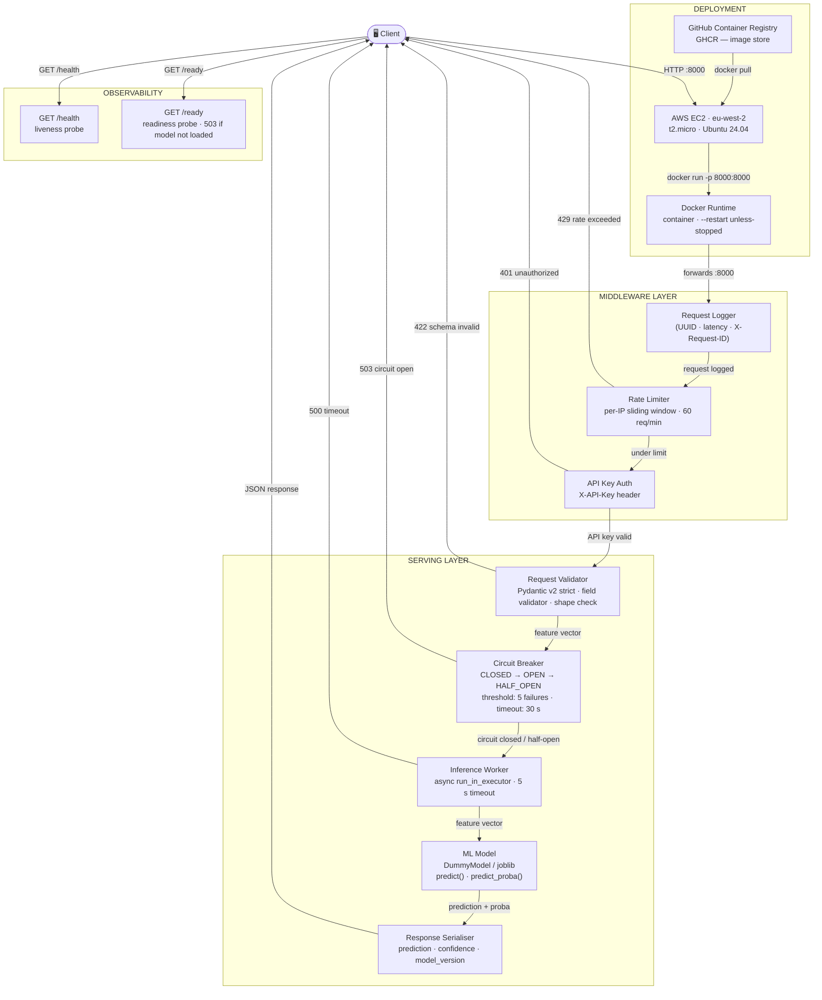
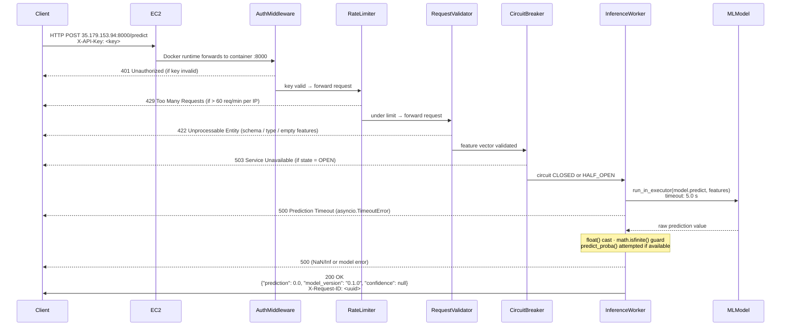

# ML Model Deployment — FastAPI Inference Service


Production-hardened FastAPI inference service demonstrating separation of training and serving concerns, with containerised deployment and automated CI/CD.

---

## Architecture Diagram



---

## Request Flow Diagram



---

## Features

- **3-endpoint REST API** — `POST /predict`, `GET /health`, `GET /ready`
- **3-layer input validation** — Pydantic v2 strict type checking → custom `field_validator` (non-empty, optional shape enforcement) → global `@app.exception_handler` for DI-level failures
- **API key authentication middleware** — `X-API-Key` header enforced when `API_KEY` env var is set; `/health` and `/ready` always exempt
- **Per-IP sliding-window rate limiting** — 60-second window, configurable via `RATE_LIMIT_PER_MINUTE`; returns 429 when exceeded
- **Circuit breaker** — three-state machine (CLOSED → OPEN after 5 consecutive failures → HALF_OPEN after 30 s); opt-in via `CIRCUIT_BREAKER_ENABLED`
- **Async inference via `run_in_executor`** — blocking `model.predict()` offloaded to thread pool; 5-second `asyncio.wait_for` timeout guard
- **Confidence score in prediction response** — `predict_proba()` called when available; safely absent (null) for models that don't implement it
- **Centralised environment config via `pydantic-settings`** — all env vars typed and validated at startup; single `Settings` instance across the app
- **Structured JSON logging with UUID request ID tracing** — every request assigned a UUID; latency logged; `X-Request-ID` echoed in response headers
- **Thread-safe singleton model loading** — `threading.Lock()` with double-checked locking prevents race conditions at startup
- **Docker containerisation** — `python:3.11-slim`, non-root `appuser`, `docker-compose.yml` for zero-config local deployment
- **GitHub Actions CI/CD** — automated test suite + Docker build/verify on every push and pull request to `main`
- **28 pytest cases, 100% pass rate** — HTTP contract testing, dependency injection overrides, schema validation, error handling, integration tests
- **Deployed to AWS EC2 (eu-west-2)** — containerised via Docker, image stored on GHCR, running with `--restart unless-stopped`
- **Live public endpoint** — `http://35.179.153.94:8000`

---

## Project Structure

```
ml-model-deployment-fastapi/
├── src/
│   └── app/
│       ├── main.py           # FastAPI app factory, lifespan hook, middleware chain
│       ├── config.py         # pydantic-settings: all env vars with types and defaults
│       ├── routes.py         # /predict, /health, /ready endpoint handlers + circuit breaker
│       ├── schemas.py        # Pydantic v2 request/response models (strict validation)
│       └── dependencies.py   # DummyModel, thread-safe singleton get_model() factory
├── tests/
│   ├── test_health.py              # /health endpoint contract (3 tests)
│   ├── test_predict_contract.py    # /predict contract incl. confidence field (6 tests)
│   ├── test_validation.py          # Input validation rejection cases (5 tests)
│   ├── test_model_dependency.py    # DI injection, singleton, startup loading (4 tests)
│   ├── test_error_handling.py      # Model exceptions → HTTP 500 (4 tests)
│   └── test_integration.py         # End-to-end flows, headers, multi-request (6 tests)
├── Dockerfile                # python:3.11-slim, non-root user, port 8000
├── docker-compose.yml        # Service definition with healthcheck on /ready
├── .env.example              # All env vars documented with safe defaults
├── .github/
│   └── workflows/
│       └── ci.yml            # test job → build job (Docker build + /health verify)
└── requirements.txt          # Pinned: fastapi 0.109, uvicorn 0.27, pydantic 2.5.3
```

---

## Environment Variables

All variables are managed by `src/app/config.py` via `pydantic-settings`. Set them in `.env` or as environment variables. Copy `.env.example` to get started.

| Variable | Type | Default | Description |
|---|---|---|---|
| `MODEL_VERSION` | `str` | `"0.1.0"` | Version tag returned in every `/predict` response |
| `MODEL_PATH` | `str` | `"models/churn_model.pkl"` | Path to the serialised model file |
| `LOG_LEVEL` | `str` | `"INFO"` | Python logging level (`DEBUG`, `INFO`, `WARNING`, `ERROR`) |
| `API_KEY` | `str` | `""` | If non-empty, all non-exempt requests must include `X-API-Key: <value>` |
| `RATE_LIMIT_PER_MINUTE` | `int` | `60` | Max requests per IP per 60-second window on `/predict` (0 = disabled) |
| `CIRCUIT_BREAKER_ENABLED` | `bool` | `false` | Enable 3-state circuit breaker on `/predict` |
| `EXPECTED_FEATURE_COUNT` | `int` | `0` | If > 0, reject requests where `len(features) ≠ N` (0 = disabled) |

---

## Quickstart — Local (without Docker)

```bash
git clone https://github.com/SourabhaKK/ml-model-deployment-fastapi
cd ml-model-deployment-fastapi
python -m venv venv
venv\Scripts\activate        # Windows PowerShell
pip install -r requirements.txt
uvicorn src.app.main:app --reload
```

The API will be available at `http://localhost:8000`.

---

## Quickstart — Docker

```bash
docker compose up --build
```

The service starts on port **8000**. Test the endpoints:

```bash
# Liveness check
curl http://localhost:8000/health

# Readiness check (503 until model is loaded)
curl http://localhost:8000/ready

# Prediction request
curl -X POST http://localhost:8000/predict \
  -H "Content-Type: application/json" \
  -d '{"features": [1.0, 2.0, 3.0, 4.0]}'
```

Expected `/predict` response:

```json
{
  "prediction": 0.0,
  "model_version": "1.0.0"
}
```

> `confidence` is omitted when the model does not implement `predict_proba`. An `API_KEY` header (`X-API-Key: <value>`) is required only when the `API_KEY` env var is set.

---

## Quickstart — Live Cloud Endpoint (AWS EC2)

The service is currently deployed on AWS EC2 (eu-west-2).

```bash
# Liveness check
curl http://35.179.153.94:8000/health

# Readiness check
curl http://35.179.153.94:8000/ready

# Prediction request
curl -X POST http://35.179.153.94:8000/predict \
  -H "X-API-Key: <api-key>" \
  -H "Content-Type: application/json" \
  -d '{"features": [0,1,0,1,24,0,0,1,0,0,1,1,0,0,0,1,0,0,0,0,0,0,0,0,0,0,0,0,0,0,0,0,0,0,0,0,0,0,0,0,0,0,0,0,0,0,0,0,0,0,0]}'
```

> The API key is required for `/predict`. Contact the repo owner for access.

---

## Running Tests

```bash
pytest tests/ -v
```

**28 tests collected, 28 passed.** Breakdown:

| File | Tests | Coverage |
|---|---|---|
| `test_health.py` | 3 | `/health` contract, schema, status |
| `test_predict_contract.py` | 6 | `/predict` contract, model_version, confidence field |
| `test_validation.py` | 5 | Empty features, wrong types, missing fields |
| `test_model_dependency.py` | 4 | DI injection, singleton, startup model load |
| `test_error_handling.py` | 4 | Model exceptions → 500, recovery after error |
| `test_integration.py` | 6 | End-to-end flows, response headers, multi-request |

---

## CI/CD

The GitHub Actions pipeline (`.github/workflows/ci.yml`) triggers on every **push to `main`** and every **pull request targeting `main`**.

Pipeline runs two sequential jobs:

1. **`test`** — checks out code, sets up Python 3.11, installs dependencies from `requirements.txt`, runs `pytest tests/ -v --tb=short`
2. **`build`** *(depends on `test` passing)* — checks out code, builds the Docker image (`docker build -t ml-api:latest .`), starts the container on port 8000, waits 8 seconds, confirms `GET /health` returns 200, then stops and removes the container

Current status: 

---

## Ecosystem Position

This service is one component in a connected ML system:

| Layer | Repo | Role |
|---|---|---|
| ML Training | customer-churn-prediction | scikit-learn pipeline → serialised model |
| LLM Backend | llm-ai-basket-builder | GPT-4o-mini + Pydantic + FastAPI |
| Model Serving | ml-model-deployment-fastapi | FastAPI · Docker · AWS EC2 · live endpoint |
| Drift Detection | ml-model-monitoring-drift-detection | PSI / KS / Chi-Square · CLI · exit codes |
| NLP Pipeline | nlp-complaint-classification-pipeline | TF-IDF + BERT · 253 tests |

---

## Engineering Notes

- **Why `run_in_executor` for inference** — `model.predict()` is a synchronous, CPU-bound call. Awaiting it directly in an `async` route handler would block the asyncio event loop for the duration of inference, preventing the server from handling any other requests concurrently. Offloading it to the default `ThreadPoolExecutor` keeps the event loop free while inference runs on a worker thread.

- **Why a circuit breaker** — without one, a degraded model (e.g., corrupt weights, OOM state) receives every incoming request, amplifying load on an already-broken component. The three-state machine (CLOSED → OPEN after 5 consecutive failures → HALF_OPEN after 30 s) sheds load immediately, then probes recovery with a single trial request before fully reopening.

- **Why `pydantic-settings` over `os.getenv`** — raw `os.getenv` returns strings and silently accepts misspellings. `pydantic-settings` validates and coerces types at import time (`int`, `bool`, `str`), raises at startup if a required variable is malformed, and provides a single `settings` object imported everywhere — eliminating scattered `os.getenv` calls and their default-value duplication.

- **Why `threading.Lock` with double-checked locking** — without the lock, two concurrent startup requests could each see `_model_instance is None` simultaneously and both proceed to instantiate the model, resulting in two copies loaded into memory. The outer `if` avoids acquiring the lock on every call after initialisation (hot path); the inner `if` inside the lock handles the race condition at first load.

- **Why `math.isfinite()` before serialisation** — a model returning `float('nan')` or `float('inf')` would cause `json.dumps()` to raise (strict JSON does not allow NaN/Infinity) or silently produce malformed output depending on the serialiser. The guard converts this into a controlled `ValueError` → HTTP 500 with a sanitised error message, before the response object is ever constructed.

- **Why `MemoryError` is re-raised explicitly** — `MemoryError` is a subclass of `Exception`. A catch-all `except Exception` block would silently swallow it and return HTTP 500, preventing the OS OOM killer from acting and suppressing alerting. Re-raising it allows the process to crash visibly, triggering container restart policies and on-call alerts.

- **Why `--restart unless-stopped`** — ensures the container automatically recovers from crashes and restarts after EC2 instance reboots, providing basic self-healing without an orchestrator like ECS or Kubernetes. Appropriate for a single-instance portfolio deployment; production scale would use ECS Fargate or Kubernetes with health-check-based rolling updates.
